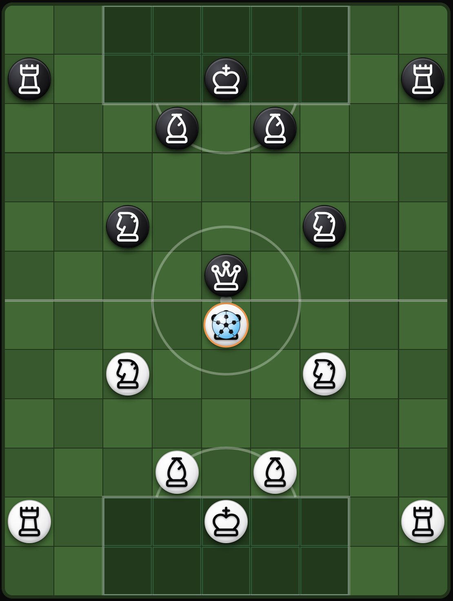

# Chess.Football — ゲームルール

> チェスの駒の動きとサッカーの目的を融合させた、2 人用のターン制ストラテジーゲーム。相手のキングにボールを当てて、相手より多くゴールを決めることを目指します。

---

## 1. 概要

- **プレイヤー**:2 人(白と黒)。
- **目的**:相手より多くゴールを決めること。パスが相手キングのマスに到達すればゴールとなります。
- **ターン**:交互。各ターンで行動側は、対局作成時に設定した数の **アクションポイント(AP)** を持ちます(**1〜5** の範囲で設定可能。デフォルトは 5)。

---

## 2. ボード

ボードは長方形で、**9 列(A〜I)× 12 行(1〜12)**、合計 108 マスです。

### エリア

各チームは自陣に **5×2 マスのエリア** を持ちます:

- **白エリア**:C〜G 列、1〜2 行。
- **黒エリア**:C〜G 列、11〜12 行。

エリアに関するルール:

1. **キングは自分のエリア内でしか動けません**。ボールを持っていても、絶対にエリアの外に出ることはできません。
2. **同じチームの他の駒は、自分のエリアに入ることができません**。
3. 相手の駒は相手エリアに **自由に入ることができます**。
4. **キングは触れられない存在**:相手のどの駒もキングのマスに踏み込めません。ボールだけが(パスによって)キングに届きます。

---

## 3. 駒

各チームには、チェスにインスパイアされた動きをする **8 個の駒** があります:

| 駒          | 数 | 初期位置(白) | 役割             |
|-------------|----|----------------|------------------|
| キング (K)  | 1  | E2             | ゴール / 目標    |
| クイーン (Q)| 1  | E6             | ミッドフィルダー |
| ルーク (R)  | 2  | A2, I2         | サイドバック     |
| ビショップ (B)| 2 | D3, F3         | センターバック   |
| ナイト (N)  | 2  | C5, G5         | フォワード       |

黒の駒は同じ配置を鏡写しにして反対側のハーフに配置します。

### 移動

| 駒        | 移動                                | 駒を飛び越える?  | エリア制限                         |
|-----------|-------------------------------------|--------------------|------------------------------------|
| キング    | 任意の方向に 1 マス                 | 不可               | **自分のエリア内のみ**             |
| クイーン  | 任意の方向に任意のマス数            | 不可               | 自分のエリアには入れない           |
| ルーク    | 縦または横に任意のマス数            | 不可               | 自分のエリアには入れない           |
| ビショップ| 斜めに任意のマス数                  | 不可               | 自分のエリアには入れない           |
| ナイト    | L 字型(2+1)                       | **可**             | 自分のエリアには入れない           |

追加ルール:

- **ブロック**:ナイト以外のすべての駒は経路上の他の駒に止められます。ナイトはあらゆる駒を飛び越せます。
- **自分の駒があるマスには移動できません。**
- **相手の駒があるマスに移動できるのは、その駒がボールを持っているときのみ**(タックル)— **ただし相手キングは触れられない**。

---

## 4. ターンの構造

各ターン、行動側は対局作成時に設定された **アクションポイント(AP)** を受け取ります — **1〜5** の範囲で設定可能(デフォルトは 5)。各アクションは 1 AP を消費します。

### キックオフ

最初のターンのキックオフを行うのは、ゲームモードによって決まります:

- **オンライン対戦(PvP)**:常に **白** がキックオフ。
- **トレーニング(対 AI)**:対局作成時にプレイヤーが **選んだ側** がキックオフ。

どちらの場合も、キックオフはキックオフ側の **クイーン** が行い、ボールはクイーンの中央マスからスタートします。**ゴール後** のキックオフは [第 7 節](#7-ゴール後) のルールに従います(失点したチームがキックオフ)。

### 可能なアクション

1. **移動** — 自分の駒を有効なマスへ動かす。
   - 各駒は **1 ターンに 1 回しか移動できません**。
   - その駒がボールを持っていれば、ボールも一緒に動きます(*ドリブル*)。

2. **パス** — ボールを持つ駒が目標マスへ蹴り出す。
   - 駒は動かず、ボールだけが飛びます。
   - ボールはその駒の移動パターンに従って飛びます。
   - 経路上の **自分の駒** は **パスに影響しません**:ボールは上を越えていきます。
   - 経路上に **相手の駒** がいると **パスをカット** されます(その相手の駒がキングなら **ゴール**)。**ナイトのパス** は例外:すべてを飛び越え、着地点だけが問われます。

3. **ターン終了** — 残り AP を放棄してターンを自発的に終わらせる。

### ターンが終わるとき

- AP が 0 になったとき。
- プレイヤーが自発的にターンを終えたとき。
- **インターセプト** または **ゴール** が発生したとき(強制終了)。

### 制限

- このターンに既に動いた駒は、再度動かせません。
- 同一の駒が **同じターン中に移動とパスの両方を行えます**(合計 2 AP)。
- 同じターン中に複数の異なる駒を動かせます。
- パスは、自分のいずれかの駒がボールを持っている場合のみ可能。

---

## 5. ボール

ボールは常にボード上のいずれかのマスにあります。**フリー** か、駒が **保持** している状態のどちらかです。

### ボールを取得する方法

- **経路でのキャプチャ**:直線移動する駒(キング、クイーン、ルーク、ビショップ)が移動し、ボールが経路上にあれば自動的に拾います。
- **着地点でのキャプチャ**:フリーのボールがあるマスで移動を終えた駒(ナイトも含む)はボールを拾います。
- **タックル**:ボールを持つ相手駒のマスへ移動すると、ボールを奪い、相手駒は隣接する直交方向の空きマスへ移されます。
  - **相手キングに対してタックルはできません。**
  - 移動は **固定の優先順位** に従います:右 → 左 → 上 → 下。相手駒はこの順序で最初に見つかった空きマスへ置かれます。
  - 攻撃側が **たった今離れたマス** は、移動先として空きマスとして数えられます:他の 4 つの直交マスが埋まっていても、攻撃側がそのいずれかから来ていれば、相手はそこへ落ち着きます。
  - 上記を適用しても **空きマスが残らない** 場合は、タックル **は許可されません**(違法な手)。

### ドリブル

ボールを持つ駒が動くと、ボールも一緒に移動します。コストは通常の移動と同じ 1 AP です。キングはドリブルできますが、**それでも自分のエリアの外には出られません**。

### パス

- ボールを持つ駒が動かずに、有効なマスへボールを蹴り出します。
- パスの目標は、駒の移動と同じ方向パターンに従います。経路上の駒は **目標候補のリストからマスを除外しません**(駒の方向線上の任意のマスを狙えます)が、相手の駒が経路上にいる場合 **そのパスはカットされます** — その相手の駒がキングであれば **ゴール** です。[インターセプト](#インターセプト) と [ゴールの決め方](#6-ゴールの決め方) を参照。
- コスト:1 AP。

### インターセプト

**ナイト以外** の駒がパスをすると、ボールは直線で飛びます。経路に相手の駒(その駒のキング以外)があると:

- **パサーに最も近い** 相手の駒がボールをカットします。
- パスを出したプレイヤーのターンは **直ちに終了** します(AP が 0 になります)。

> **重要**:ナイトのパスは **カットされません**。ボールは正確な着地点まで「飛び越え」ます。

---

## 6. ゴールの決め方

**パス** が相手キングのマスに到達したときにゴールとなります:

- **直線パス**(クイーン、ルーク、ビショップ、キング):ボールは経路に沿って飛びます。最初に当たった相手の駒が:
  - **相手キング** なら → **ゴール!**(ボールはキングのマスで止まり、ターン終了)。
  - **他の相手の駒** なら → インターセプト。
- **ナイトのパス**:正確な L 字の着地点だけが問われます。着地点が相手キングなら → **ゴール!**

> 戦術的なヒント:直線で **キングの先** を狙ったパスもゴールになります — キングが経路上最初の相手駒なので、ボールはそこで止まります。

---

## 7. ゴール後

1. スコアが更新されます(得点側 +1)。
2. ボードは初期布陣にリセットされます。
3. **失点した** チームがキックオフします:そのクイーンが中央でボールを持って開始します。
4. 失点したチームがゴール後の最初のターンを行います。

---

## 8. 試合の終了

試合は、いずれかのチームが対局作成時に設定された **目標ゴール数** に達した時点で終了します。

- 目標ゴール数は **1〜10 の範囲で設定可能**(デフォルトは 3)。
- 一方が目標数に達した瞬間、試合は直ちに終了し、そのチームが勝者となります。
- **引き分けはありません**:目標ゴールには必ず得点者が必要なので、必ず勝者が決まります。

---

## 9. キングに関する特別ルール

### 9a. キングはボールを 1 ターン以上保持できない

キングはボールを受け取り、そのターン中は保持できますが、**次のターンが終わる前にボールを手放さなければなりません**。

- キングがボールを持ったままターンを終えると、*キングはボールを手放さなければならない* というフラグが立ちます。
- そのチームの **次のターン** では、キングはパスを行わなければなりません。
- 最後の AP までキングでパスを行わなければ、システムが **自動的に** キングに隣接する **空きマス** にボールを放出します(その最後の AP を消費)。まず 4 つの直交マスを試し、すべて埋まっていれば 4 つの斜めマスを試します。
- 最後の有効 AP のインジケーターは王冠(👑)に変わり、プレイヤーに警告します。

**理由**:勝っているプレイヤーがキングのもとにボールを留めて時間稼ぎをすることを防ぎます。

### 9b. キーパーへのバックパス

キングがボールを手放した後(自発的でも自動でも)、**同じチームのどの駒もキングへボールを返すことはできません**。相手の駒がボールに触れるまでこの制限は続きます。

- キングがパスを出すと、レシーバーとしてブロックされた状態になります。
- キングのマスは、味方からの有効なパス先から除外されます。
- **相手の駒がボールに触れる**(インターセプト、タックル、ゴール)とブロックは解除されます。

**理由**:サッカーのキーパーへのバックパスのルールを反映 — キングへ繰り返しパスして時間を稼ぐことを防ぎます。

---

## 10. 用語集

- **AP(アクションポイント)**:対局作成時に 1〜5 で設定可能(デフォルト 5);各アクションは 1 AP を消費。
- **ドリブル**:ボールを持ったまま駒を動かすこと。
- **パス**:駒を動かさずにボールを蹴ること。
- **タックル**:ボールを持つ相手の駒のマスへ移動して奪うこと。
- **インターセプト**:相手の駒が経路上のパスをカットすること。パサーのターンは終了。
- **ゴール**:相手キングのマスに到達するパス。
- **エリア**:ボードの両端にある 5×2 のゾーン。守備側のキングだけが踏み込めます。

---
